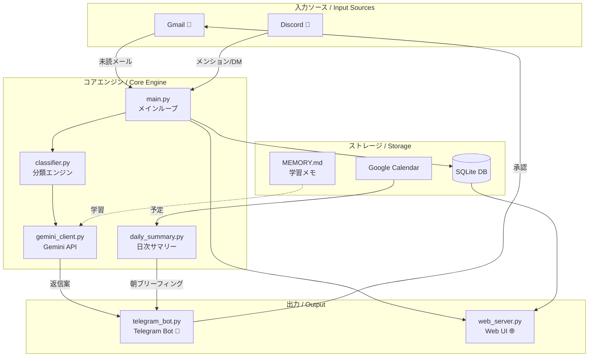
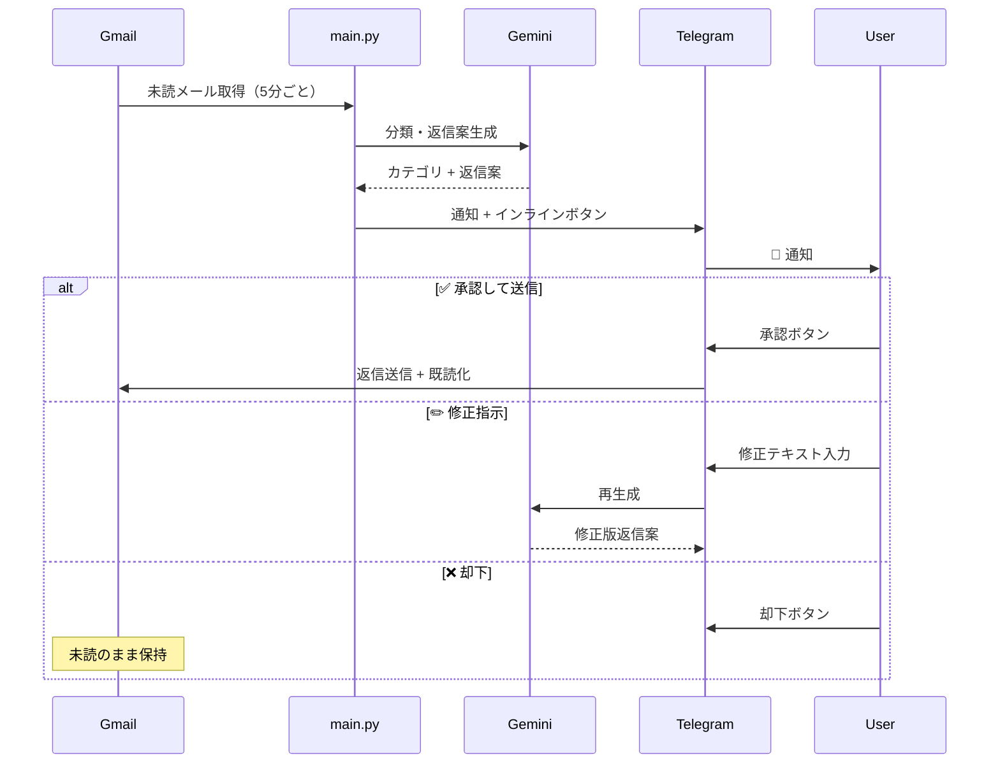

# my-secretary 🤖

> **AI個人秘書Bot** — Gmail・Discord を監視し、Gemini で分類・返信案を生成、Telegram で承認フローを実行する。

[](https://www.python.org/)
[](https://ai.google.dev/)
[](https://core.telegram.org/bots)
[](https://fastapi.tiangolo.com/)
[](LICENSE)

---

## 概要 / Overview

**日本語**

`my-secretary` は個人向け AI 秘書 Bot です。5分ごとに Gmail と Discord を監視し、Gemini が重要度を判定して返信案を自動生成。Telegram のインラインボタンで承認・修正・却下を操作できます。Web ダッシュボードから受信ログや連絡先の管理も可能です。

**English**

`my-secretary` is a personal AI secretary bot. It monitors Gmail and Discord every 5 minutes, uses Gemini to classify messages and generate reply drafts, and lets you approve, revise, or reject them via Telegram inline buttons. A web dashboard provides email logs and contact management.

---

## アーキテクチャ / Architecture



---

## 承認フロー / Approval Flow



---

## 機能一覧 / Features

| 機能 | 詳細 |
|------|------|
| 📧 **Gmail 監視** | 5分ごとに未読チェック、4カテゴリに自動分類 |
| 🤖 **Gemini 返信生成** | 日/英を自動判定し適切なスタイルで返信案作成 |
| 📱 **Telegram 承認フロー** | インラインボタンで承認・修正・却下 |
| 💬 **Discord 監視** | メンション・DM を検知して要約通知 |
| ☀️ **朝のブリーフィング** | 毎朝8時にカレンダー予定 + メール概況を送信 |
| 🌐 **Web ダッシュボード** | FastAPI + SQLite でメールログ・連絡先管理 |
| 🧠 **MEMORY.md 学習** | 分類修正ログを蓄積してパーソナライズ |

---

## セットアップ / Setup

### 必要環境 / Requirements

- Python 3.11+
- Gmail API 認証情報（GCP プロジェクト）
- Gemini API キー
- Telegram Bot トークン + chat_id

### インストール / Installation

```bash
# リポジトリをクローン
git clone https://github.com/yourname/my-secretary.git
cd my-secretary

# 依存パッケージをインストール
pip install -r requirements.txt

# 設定ファイルを作成
cp config.yaml.example config.yaml
# config.yaml を編集して API キー等を設定
```

### 設定ファイル / Configuration

```yaml
# config.yaml
gmail:
  credentials_path: "./credentials.json"
  check_interval_minutes: 5

gemini:
  api_key: "YOUR_GEMINI_API_KEY"
  model: "gemini-2.5-flash"

telegram:
  bot_token: "YOUR_BOT_TOKEN"
  chat_id: "YOUR_CHAT_ID"

daily_summary:
  send_time: "08:00"  # JST

quiet_hours:
  enabled: true
  start: "00:00"
  end: "07:00"
```

### 起動 / Launch

```bash
cd src
python main.py
```

初回起動時にブラウザが開き、Gmail の OAuth 認証を求められます。`token.json` が生成されると以降は自動認証されます。

**Windows バッチファイルで起動する場合:**

```bat
start_secretary.bat
```

---

## プロジェクト構成 / Project Structure

```
my-secretary/
├── src/
│   ├── main.py              # メインループ・初期化
│   ├── gmail_client.py      # Gmail OAuth2 + 送受信
│   ├── gemini_client.py     # Gemini API クライアント
│   ├── classifier.py        # ルールベース + Gemini 分類
│   ├── telegram_bot.py      # PTB v20+ 非同期 Bot
│   ├── daily_summary.py     # 朝のブリーフィング生成
│   ├── calendar_client.py   # Google Calendar 連携
│   ├── discord_client.py    # Discord 監視
│   ├── web_server.py        # FastAPI Web ダッシュボード
│   ├── database.py          # SQLite DB 操作
│   └── templates/           # Web UI テンプレート
├── docs/                    # スクリーンショット置き場
├── config.yaml.example      # 設定ファイルのサンプル
├── requirements.txt
├── start_secretary.bat      # Windows 起動スクリプト
└── AGENT.md                 # AI エージェント定義
```

---

## スクリーンショット / Screenshots

> `docs/` ディレクトリに画像を配置してください。

<!--  -->
<!--  -->

---

## 技術スタック / Tech Stack

| カテゴリ | ライブラリ |
|---------|-----------|
| AI / LLM | `google-genai` (Gemini 2.5 Flash) |
| Gmail | `google-api-python-client`, `google-auth-oauthlib` |
| Telegram | `python-telegram-bot` v20+ (非同期) |
| Discord | `discord.py` |
| Web UI | `FastAPI`, `uvicorn`, `Jinja2` |
| DB | `aiosqlite` (SQLite) |
| Calendar | Google Calendar API |

---

## ライセンス / License

MIT License — 個人利用・学習目的でご自由にどうぞ。
