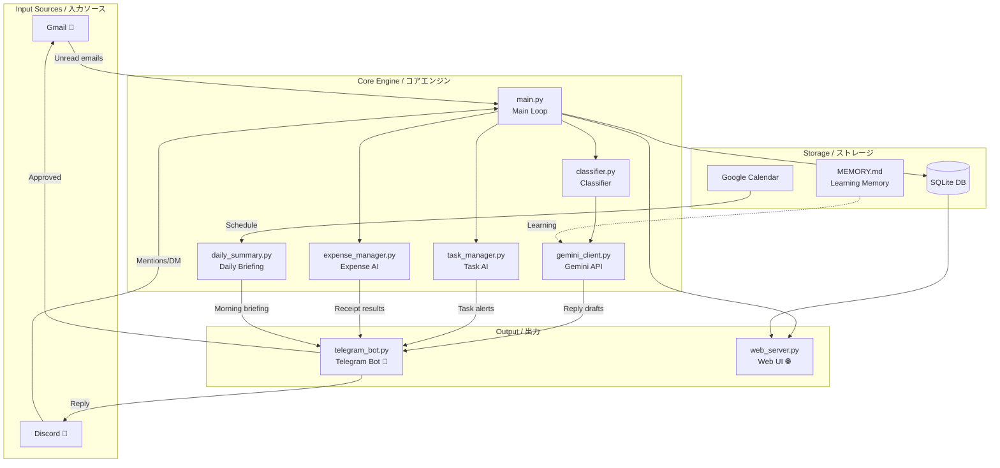
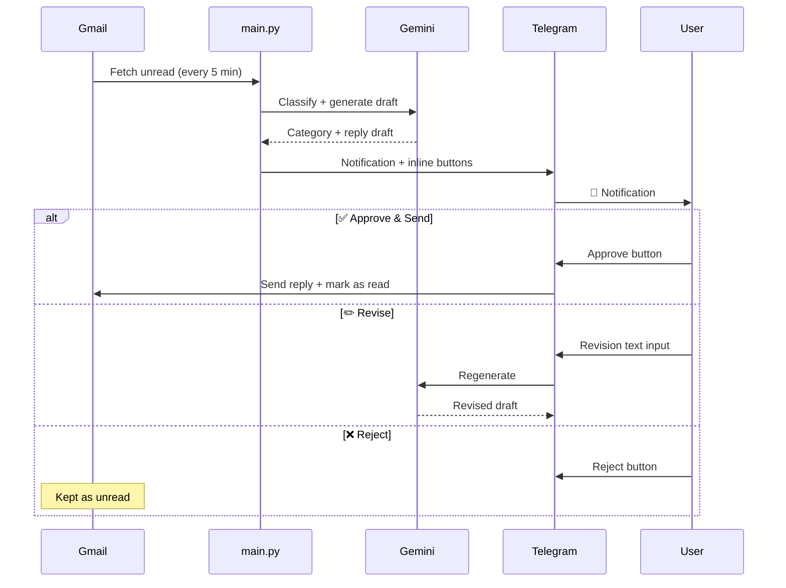

# my-secretary 🤖

> **AI Personal Secretary Bot** — Monitors Gmail & Discord, classifies messages with Gemini, generates reply drafts, and runs approval workflows via Telegram.

> **AI個人秘書Bot** — Gmail・Discordを監視し、Geminiで分類・返信案を生成、Telegramで承認フローを実行する。

[](https://www.python.org/)
[](https://ai.google.dev/)
[](https://core.telegram.org/bots)
[](https://fastapi.tiangolo.com/)
[](LICENSE)

---

## Overview / 概要

**English**

`my-secretary` is a personal AI secretary bot for freelancers and busy professionals. It monitors Gmail and Discord every 5 minutes, uses Gemini to classify messages by urgency, generates context-aware reply drafts, and lets you approve, revise, or reject them via Telegram inline buttons. It also features AI-powered task management with automatic extraction from emails and messages, Discord reply assistance with writing style learning, and expense/receipt management with MoneyForward CSV matching for tax filing. A web dashboard provides full visibility into emails, tasks, expenses, and system status.

**日本語**

`my-secretary` はフリーランス・多忙なプロフェッショナル向けのAI個人秘書Botです。5分ごとにGmailとDiscordを監視し、Geminiが重要度を判定して返信案を自動生成。Telegramのインラインボタンで承認・修正・却下を操作できます。さらに、メールやメッセージからのAIタスク自動抽出、Discordの文体学習による返信アシスタント、レシートOCRとMoneyForward CSV照合による経費管理（確定申告対応）も搭載。Webダッシュボードからメール・タスク・経費・システム状態を一覧管理できます。

---

## Architecture / アーキテクチャ



---

## Approval Flow / 承認フロー



---

## Features / 機能一覧

### Core / コア機能

| Feature | Details |
|---------|---------|
| 📧 **Gmail Monitoring** | Checks unread mail every 5 min, auto-classifies into 4 categories |
| 🤖 **Gemini Reply Generation** | Detects JP/EN language automatically, generates style-appropriate drafts |
| 📱 **Telegram Approval Flow** | Approve, revise, or reject via inline buttons |
| 💬 **Discord Monitoring** | Detects mentions & DMs, sends digest notifications |
| 📅 **Google Calendar Integration** | Schedule-aware prioritization, meeting participant email priority |
| ☀️ **Daily Briefing** | Morning summary at 08:00 with calendar, tasks, and expenses |
| 🌐 **Web Dashboard** | FastAPI + SQLite — emails, tasks, expenses, contacts, API usage, real-time feed |
| 🧠 **MEMORY.md Learning** | Accumulates classification corrections for personalization |

### AI Task Manager / AIタスクマネージャー

| Feature | Details |
|---------|---------|
| 📌 **Auto-extraction** | Gemini detects tasks from emails and Discord messages automatically |
| 🎯 **AI Prioritization** | Automatic priority assignment based on deadline, sender importance, calendar |
| ⏰ **Deadline Reminders** | Configurable reminders before due date (default: 3 hours) |
| 📋 **Task Board (Web UI)** | Kanban-style board: Todo / In Progress / Done |
| 💬 **Telegram Commands** | `/todo`, `/tasks`, `/done` with inline buttons |

### Discord Reply Assistant / Discord返信アシスタント

| Feature | Details |
|---------|---------|
| 🎨 **Style Learning** | Analyzes your past messages to learn tone, emoji usage, and per-person style |
| 💬 **Reply Draft Generation** | Generates casual replies matching your writing style |
| ✅ **Telegram Approval** | Send, edit, or ignore Discord replies from Telegram |
| ⏰ **Unreplied Reminders** | Reminds you of unanswered mentions/DMs (default: 2 hours) |

### Expense & Receipt Management / 経費・レシート管理

| Feature | Details |
|---------|---------|
| 📸 **Receipt OCR** | Send a receipt photo on Telegram → Gemini extracts date, store, amount, items |
| 🏷️ **Auto-categorization** | Rule-based + Gemini classification for 青色申告 tax categories |
| 📥 **MoneyForward CSV Import** | Import MF ME CSV with encoding auto-detection and dedup |
| 🔗 **3-tier Matching** | Certain (auto) / Likely (suggest) / Uncertain (manual review) |
| 📊 **Monthly/Annual Reports** | Category breakdown, payment method split, CSV export for tax filing |
| 💰 **Expense Web UI** | Expense list, category chart, CSV upload, manual entry |

### Telegram Commands / Telegramコマンド一覧

| Command | Description |
|---------|-------------|
| `/help` | Show command list / コマンド一覧 |
| `/status` | System status, uptime, API usage / システム状態 |
| `/pending` | Pending approval emails / 承認待ちメール |
| `/check` | Trigger immediate email check / メール即時チェック |
| `/search <keyword>` | Search emails (last 30 days) / メール検索 |
| `/schedule` | Today's calendar / 今日の予定 |
| `/stats` | Daily/weekly statistics / 統計レポート |
| `/contacts` | Important contacts list / 重要連絡先 |
| `/quiet [hours]` | Pause notifications / 通知一時停止 |
| `/resume` | Resume notifications / 通知再開 |
| `/todo <task> [date]` | Add a task / タスク追加 |
| `/tasks` | Task list with inline buttons / タスク一覧 |
| `/done <id>` | Complete a task / タスク完了 |
| `/expense` | Expense management menu / 経費管理 |

---

## Setup / セットアップ

### Requirements / 必要環境

- Python 3.11+
- Gmail API credentials (GCP project)
- Gemini API key
- Telegram Bot token + chat_id
- Discord Bot token (optional)
- Google Calendar API credentials (optional)

### Installation / インストール

```bash
# Clone the repository / リポジトリをクローン
git clone https://github.com/mayonaka-ratori/myserika.git
cd my-secretary

# Install dependencies / 依存パッケージをインストール
pip install -r requirements.txt

# Create config file / 設定ファイルを作成
cp config.yaml.example config.yaml
# Edit config.yaml with your API keys / API キー等を設定
```

### Configuration / 設定ファイル

```yaml
# config.yaml
gmail:
  credentials_path: "./credentials.json"
  check_interval_minutes: 5

gemini:
  api_key: "YOUR_GEMINI_API_KEY"
  model: "gemini-2.5-flash"

telegram:
  bot_token: "YOUR_BOT_TOKEN"
  chat_id: "YOUR_CHAT_ID"

discord:
  bot_token: "YOUR_DISCORD_BOT_TOKEN"
  monitored_channels:
    - channel_id: "CHANNEL_ID"
      name: "general"
  dm_monitoring: true
  summary_interval_minutes: 360
  reply_generation: true
  style_learning: true
  reply_reminder_hours: 2

calendar:
  enabled: true

task:
  enabled: true
  auto_extract: true
  reminder_hours_before: 3
  daily_top_n: 3

expense:
  enabled: true
  receipt_save_path: "./data/receipts/"
  default_tax_rate: 0.10
  fiscal_year_start: "01-01"

web:
  enabled: true
  host: "0.0.0.0"
  port: 8080

daily_summary:
  send_time: "08:00"

quiet_hours:
  enabled: true
  start: "23:00"
  end: "07:00"
```

### Launch / 起動

```bash
cd src
python main.py
```

On first launch, a browser window will open for Gmail OAuth authentication. Once `token.json` is generated, subsequent launches authenticate automatically.

初回起動時にブラウザが開き、GmailのOAuth認証を求められます。`token.json` が生成されると以降は自動認証されます。

**Windows:**

```bat
start_secretary.bat
```

---

## Project Structure / プロジェクト構成

```
my-secretary/
├── src/
│   ├── main.py                # Main loop & initialization / メインループ・初期化
│   ├── gmail_client.py        # Gmail OAuth2 + send/receive / Gmail送受信
│   ├── gemini_client.py       # Gemini API client / Geminiクライアント
│   ├── classifier.py          # Rule-based + Gemini classification / 分類エンジン
│   ├── telegram_bot.py        # Entry point + dispatcher / Botエントリポイント
│   ├── daily_summary.py       # Morning briefing generator / 朝のブリーフィング
│   ├── calendar_client.py     # Google Calendar integration / カレンダー連携
│   ├── discord_client.py      # Discord monitoring + style learning / Discord監視
│   ├── web_server.py          # FastAPI web dashboard / Webダッシュボード
│   ├── database.py            # SQLite DB operations / DB操作
│   ├── task_manager.py        # AI task extraction & management / タスク管理
│   ├── expense_manager.py     # Receipt OCR & expense management / 経費管理
│   ├── utils.py               # Shared utilities / 共通ユーティリティ
│   ├── handlers/              # Telegram handler modules / ハンドラモジュール
│   │   ├── __init__.py
│   │   ├── common.py          # Shared helpers & notification senders
│   │   ├── email_handlers.py  # Email approval workflow
│   │   ├── discord_handlers.py # Discord reply approval
│   │   ├── task_handlers.py   # Task commands & callbacks
│   │   └── expense_handlers.py # Expense/receipt/CSV handlers
│   ├── templates/             # Web UI templates / Webテンプレート
│   └── static/                # Static assets / 静的ファイル
├── data/
│   ├── secretary.db           # SQLite database
│   └── receipts/              # Receipt images (gitignored)
├── docs/                      # Screenshots / スクリーンショット
├── logs/                      # Log files / ログファイル
├── scripts/                   # Utility scripts / ユーティリティスクリプト
├── .claude/commands/          # Claude Code custom skills
├── config.yaml.example        # Config template / 設定テンプレート
├── requirements.txt           # Python dependencies
├── start_secretary.bat        # Windows launch script
├── stop_secretary.bat         # Windows stop script
├── AGENT.md                   # AI agent definition / エージェント定義
├── MEMORY.md                  # Learning memory / 学習メモリ
└── contacts.md                # Contact list / 連絡先リスト
```

---

## Screenshots / スクリーンショット

> Screenshots will be added to the `docs/` directory.
>
> スクリーンショットは `docs/` ディレクトリに追加予定です。

<!--  -->
<!--  -->
<!--  -->
<!--  -->

---

## Tech Stack / 技術スタック

| Category | Library |
|----------|---------|
| AI / LLM | `google-genai` (Gemini 2.5 Flash) |
| Gmail | `google-api-python-client`, `google-auth-oauthlib` |
| Telegram | `python-telegram-bot` v20+ (async) |
| Discord | `discord.py` |
| Web UI | `FastAPI`, `uvicorn`, `Jinja2` |
| Database | `aiosqlite` (SQLite) |
| Calendar | Google Calendar API |
| Image Processing | `Pillow` |

---

## Development / 開発

This project is developed using [Claude Code](https://docs.anthropic.com/en/docs/claude-code) with custom skills for token-efficient workflows:

このプロジェクトは [Claude Code](https://docs.anthropic.com/en/docs/claude-code) を使用して開発されています:

| Skill | Description |
|-------|-------------|
| `/syntax-check` | Python AST syntax check (zero AI tokens) |
| `/commit` | Auto-generate commit message from diff (Haiku) |
| `/bot [status\|start\|stop]` | Bot process control (zero AI tokens) |

---

## License / ライセンス

MIT License — Free for personal use and learning.

MIT License — 個人利用・学習目的でご自由にどうぞ。
